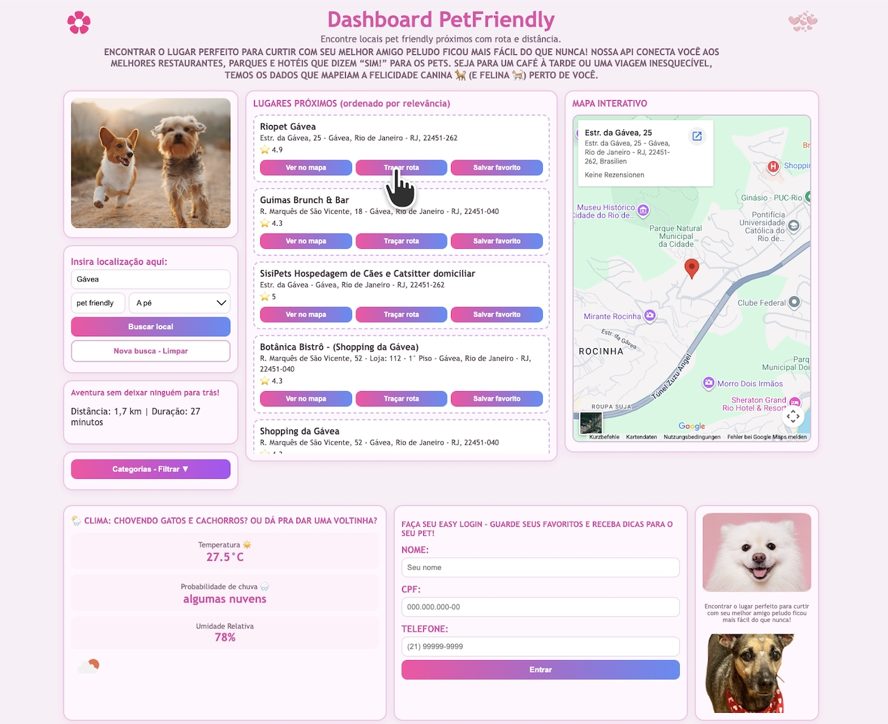

# PetFriendly MVP

This project is a system for searching for pet-friendly places, including parks, squares and establishments, with distance and route calculation features. The system is divided into two main parts: the API (Back-End - https://github.com/Elainecbr/petfriendly-api) and the Dashboard (Front-End).
<p align="center">

</p>

# PetFriendly Dashboard 🎀
This is the PetFriendly (Front-End) Dashboard.  Web interface for search of pet friendly locations, with route, weather and favorites per user.



---

## 📋 Index
1. [Objective](#objective)
2. [Project Structure](#project structure)
3. [Installation](#installation)
4. [Developing Implementation](#execution-in-development)
5. [Execution with Docker](#run-with-docker)
6. [How to Use](#how-use)
7. [API configuration](#api configuration)

---

## 🎯 Goal

Responsive Dashboard for the PETFriendly MVP that allows:

- dashboard URL (production): [https://petfriendly-dashboard.onrender.com](https://petfriendly-dashboard.onrender.com)
- API URL (production): [https://petfriendly-api.onrender.com](https://petfriendly-api.onrender.com)

- ✅ Search pet friendly locations by location
- ✅ Filter by category
- ✅ View on map (Google Maps)
- ✅ Calculate route between origin and destination
- ✅ See real-time weather
- ✅ Make Easy Login and save favorites
- ✅ Persist session in the browser

---

## 📁 Project Structure

```text
petfriendly-dashboard/
├── index.html # Main page commented
├─ style.css # Responsive styles commented
├─ app.js # Main JavaScript logic (production)
├─ script.js # JavaScript logic reference copy
├── config.js # API URL configuration
├── img/
│ ├─ pets.jpg # Main photo
│ ├─ pet2.jpg # Decoration
│ ├─ pet3.png # Decoration (my puppy Laika)
│ ├─ flower.png # Decorative icon
│ └─ coracao.png # Decorative icon
├── Dockerfile # Docker Image (Nginx)
├── docker-compose.yml # Local orchestration
├─ .gitignore # Git ignore
└─ README.md # This file
````

### Description of the files

| Archive | Function |
|--------------------------------------------------------
| `index.html` | Page structure + commented sections |
| `style.css` | Layout responsive grid + cards + media queries |
| `script.js` | Search logic, route, weather, login and favorites |
| `config.js` | API base URL (easy ambient exchange) |
| `img/` | Decorative and functional images |

---

## 💾 Step-by-step installation

### Prerequisites
- **Python 3.7+** (for local server) or **Docker**
- **Git**
- **Modern browser** (Chrome, Firefox, Safari, Edge)

### Step 1: Clone the repository

```bash
git clone https://github.com/Elainecbr/petfriendly-dashboard.git
cd petfriendly-dashboard
````

### Step 2: Check Structure
```bash
ls -la
````

It should appear: `index.html`, `style.css`, `app.js`, `config.js`, `img/`, `Dockerfile`, `docker-compose.yml`.

---

## 🚀 Execution in Development

### Option A: Use Python (simpler)
```bash
python3 -m http.server 5500
````

Open in the browser:
- `http://127.0.0.1:5500`

**Stop:**
- Press `Ctrl+C` on the terminal

### Option B: Use Node.js (if you have installed)
```bash
npx http-server -p 5500
````

---

## 🐳 Execution with Docker

### Image Build
```bash
docker build -t petfriendly-dashboard:latest .
````

### Rotate container (no docker-compose)
```bash
docker run --rm -p 5500:80 petfriendly-dashboard:latest
````

### Running with docker-compose (recommended)
```bash
docker compose up --build
````

Open:
- `http://127.0.0.1:5500`

### Stop Container
```bash
docker compose down
````

---

## 📖 How To Use

### 1️⃣ Searching for locals
1. In the field **"Enter location here"**, type:
   - Neighborhood (e.g. `Copacabana`)
   - City (e.g. `Rio de Janeiro`)
   - ZIP code (ex: `22040020`)

2. Select **mode of transport**:
   - On foot (walking)
   - Car (driving)
   - Bicycle (bicycling)
   - Public transport (transit)

3. Click **"Search Local"**

### 2️⃣ Filter by Category
1. Click **"Categories - Filter ▼"**
2. Select a category (Park, Hotel, Veterinary, etc.)
3. The list will be filtered automatically

### 3️⃣ See on map
1. In the list of results, click **"View on map"**
2. The map will be centralized to the selected location

###4️⃣ Route
1. In the list of results, click **"Trace route"**
2. The API will calculate:
   - Distance in km
   - Estimated duration
   - Type of transportation chosen
3. The map will be updated with the route

### 5️⃣ Save favorite
1. Make **Easy Login** first (fill name, CPF, phone)
2. Click **"Enter"**
3. In the list of results, click **"Save Favorite"**
4. Favorite will be associated with your user

### 6️⃣ Check climate
When searching, the **weather block** will be updated with:
- Current temperature
- Probability of rain
- Relative humidity
- Visual icon of climate

---

## 🔌 API configuration

### Where is it set up?

File: `config.js`

```js
const isLocalhost = ["localhost", "127.0.0.1"].includes(window.location.hostname);

window.APP_CONFIG = {
  API_BASE_URL: isLocalhost ? "http://127.0.0.1:800" : "https://petfriendly-api.onrender.com",
  ENDPOINTS: {
    SEARCH_PLACES: "/places/search",
    GET_ROUTE: "/places/route",
    FAVORITES: "/places/favorites"
  }
};
````

### How does the API URL work?

The `config.js` file automatically chooses the local API in development and the API published in Render in production.

- In place: `http://127.0.0.1:8000`
- In production: `https://petfriendly-api.onrender.com`

### Check if the API is running

In the browser, access:

- `http://127.0.0.1:8000/docs` (Swagger)
- `https://petfriendly-api.onrender.com/docs` (production)

If you return Swagger/JSON, the API is online. ✅

---

## 🎨 Responsiveness

The dashboard was developed with responsive **CSS**:

- ✅ Desktop (1360px+)
- ✅ Tablet (820px - 1200px)
- ✅ Mobile (< 820px)

Test by resizing the window or opening on mobile device.

---

## 📝 Comments on the code

All files (HTML, CSS, JS) are **fully commented**:

### HTML

Sections, forms, cards — each element with its function.

### CSS

Classes, responsiveness, grid — each block with its purpose.

### JavaScript

Search, route, weather, login functions — each stream explained.

Example:

```js
/*
  Do the main search of locations.

  Flow:
  1. reads the typed location;
  2. converts zip code to address when necessary;
  3. flame /places/search;
  ...
*/
async function searchLocals() { ... }
````

---

## 🛠️ Technologies

| Technology | Function |
| --- | -- - |
| **HTML5** | Semantic structure |
| **CSS3** | Layout grid and responsiveness |
| **JavaScript Vanilla** | Logic without frameworks |
| **Fetch API** | HTTP Calls |
| **Google Maps Embed** | Map view |
| **ViaCEP API** | CEP Conversion |
| **Nginx** (Docker) | Web server |

----


---

## 🔍 Understanding the flow

### Search flow

1. User types location
2. Frontend sends `GET /places/search` to API
3. API query Google Places
4. API returns JSON
5. Frontend renders list
6. Frontend seeks weather with `GET /weather`

### Favorite flow

1. User makes Easy Login → `POST /users/easy-login`
2. API creates/updates user in the bank
3. Frontend saves `user_id` on siteStorage
4. User clicks "Save favorite"
5. Frontend sends `POST /places/favorites? user_id=... `
6. API persists favorite in SQLite

---

## 🚀 Ready for delivery

- ✅ Dockerfile at the root
- ✅ docker-compose.yml at the root
- ✅ All files commented
- ✅ Full README
- ✅ Executable via Docker
- ✅ Responsive (mobile/tablet/desktop)
- ✅ Integrated with API
