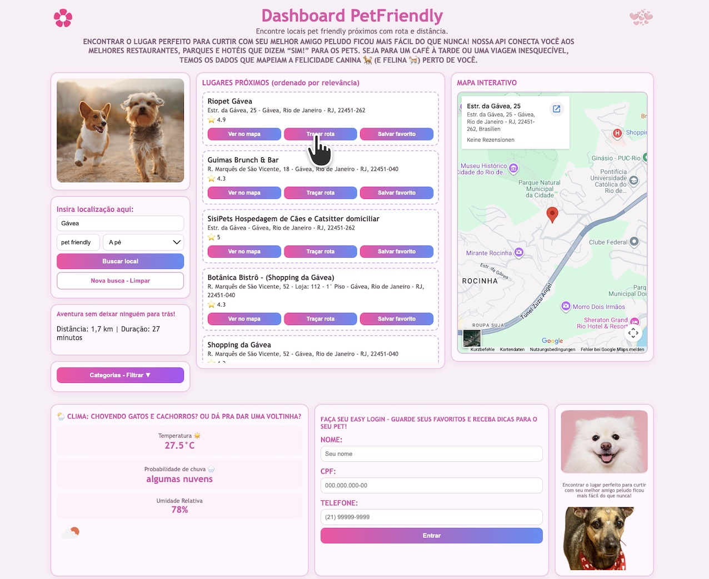

# PetFriendly MVP

Este projeto é um sistema para busca de lugares pet-friendly, incluindo parques, praças e estabelecimentos, com funcionalidades de cálculo de distância e rotas. O sistema é dividido em duas partes principais: a API (Back-End) e o Dashboard (Front-End).
<p align="center">

</p>

# PetFriendly Dashboard 🎀
Este é o Dashboard PetFriendly (Front-End).  Interface web para busca de locais pet friendly, com rota, clima e favoritos por usuário.



---

## 📋 Índice
1. [Objetivo](#objetivo)
2. [Estrutura do Projeto](#estrutura-do-projeto)
3. [Instalação](#instalação)
4. [Execução em Desenvolvimento](#execução-em-desenvolvimento)
5. [Execução com Docker](#execução-com-docker)
6. [Como Usar](#como-usar)
7. [Configuração da API](#configuração-da-api)

---

## 🎯 Objetivo

Dashboard responsivo para o MVP PetFriendly que permite:
- ✅ Buscar locais pet friendly por localização
- ✅ Filtrar por categoria
- ✅ Visualizar no mapa (Google Maps)
- ✅ Calcular rota entre origem e destino
- ✅ Ver clima em tempo real
- ✅ Fazer Easy Login e salvar favoritos
- ✅ Persistir sessão no navegador

---

## 📁 Estrutura do Projeto

```text
petfriendly-dashboard/
├── index.html               # Página principal comentada
├── style.css                # Estilos responsivos comentados
├── script.js                # Lógica JavaScript comentada
├── config.js                # Configuração da URL da API
├── img/
│   ├── pets.jpg             # Foto principal
│   ├── pet2.jpg             # Decoração
│   ├── pet3.png             # Decoração (meu cachorrinho Laika)
│   ├── flor.png             # Ícone decorativo
│   └── coracao.png          # Ícone decorativo
├── Dockerfile               # Imagem Docker (Nginx)
├── docker-compose.yml       # Orquestração local
├── .gitignore               # Git ignore
└── README.md                # Este arquivo
```

### Descrição dos arquivos

| Arquivo | Função |
|---------|--------|
| `index.html` | Estrutura da página + seções comentadas |
| `style.css` | Layout grid responsivo + cards + media queries |
| `script.js` | Lógica de busca, rota, clima, login e favoritos |
| `config.js` | URL base da API (troca fácil de ambiente) |
| `img/` | Imagens decorativas e funcionais |

---

## 💾 Instalação passo-a-passo

### Pré-requisitos
- **Python 3.7+** (para servidor local) ou **Docker**
- **Git**
- **Navegador moderno** (Chrome, Firefox, Safari, Edge)

### Passo 1: Clonar o repositório
```bash
git clone https://github.com/SEU_USUARIO/petfriendly-dashboard.git
cd petfriendly-dashboard
```

### Passo 2: Verificar estrutura
```bash
ls -la
```

Deve aparecer: `index.html`, `style.css`, `script.js`, `config.js`, `img/`, `Dockerfile`, `docker-compose.yml`.

---

## 🚀 Execução em Desenvolvimento

### Opção A: Usar Python (mais simples)
```bash
python3 -m http.server 5500
```

Abrir no navegador:
- `http://127.0.0.1:5500`

**Parar:**
- Pressionar `Ctrl+C` no terminal

### Opção B: Usar Node.js (se tiver instalado)
```bash
npx http-server -p 5500
```

---

## 🐳 Execução com Docker

### Build da imagem
```bash
docker build -t petfriendly-dashboard:latest .
```

### Rodar container (sem docker-compose)
```bash
docker run --rm -p 5500:80 petfriendly-dashboard:latest
```

### Rodar com docker-compose (recomendado)
```bash
docker compose up --build
```

Abrir:
- `http://127.0.0.1:5500`

### Parar container
```bash
docker compose down
```

---

## 📖 Como Usar

### 1️⃣ Buscar locais
1. No campo **"Insira localização aqui"**, digitar:
   - Bairro (ex: `Copacabana`)
   - Cidade (ex: `Rio de Janeiro`)
   - CEP (ex: `22040020`)

2. Selecionar **modo de transporte**:
   - A pé (walking)
   - Carro (driving)
   - Bicicleta (bicycling)
   - Transporte público (transit)

3. Clicar em **"Buscar local"**

### 2️⃣ Filtrar por categoria
1. Clicar em **"Categorias - Filtrar ▼"**
2. Selecionar uma categoria (Parque, Hotel, Veterinária, etc.)
3. A lista será filtrada automaticamente

### 3️⃣ Ver no mapa
1. Na lista de resultados, clicar em **"Ver no mapa"**
2. O mapa será centralizado no local selecionado

### 4️⃣ Traçar rota
1. Na lista de resultados, clicar em **"Traçar rota"**
2. A API calculará:
   - Distância em km
   - Duração estimada
   - Tipo de transporte escolhido
3. O mapa será atualizado com a rota

### 5️⃣ Salvar favorito
1. Fazer **Easy Login** primeiro (preencher nome, CPF, telefone)
2. Clicar em **"Entrar"**
3. Na lista de resultados, clicar em **"Salvar favorito"**
4. Favorito será associado ao seu usuário

### 6️⃣ Consultar clima
Ao fazer a busca, o **bloco de clima** será atualizado com:
- Temperatura atual
- Probabilidade de chuva
- Umidade relativa
- Ícone visual do clima

---

## 🔌 Configuração da API

### Onde está configurado?
Arquivo: `config.js`

```js
window.APP_CONFIG = {
  API_BASE_URL: "http://127.0.0.1:8000"
};
```

### Como trocar URL?
Se a API estiver em outro servidor (ex: produção), editar `config.js`:

```js
window.APP_CONFIG = {
  API_BASE_URL: "https://api.meuprojeto.com"
};
```

### Verificar se API está rodando
No navegador, acessar:
- `http://127.0.0.1:8000/docs` (Swagger)

Se retornar JSON, a API está online. ✅

---

## 🎨 Responsividade

O dashboard foi desenvolvido com **CSS responsivo**:
- ✅ Desktop (1360px+)
- ✅ Tablet (820px - 1200px)
- ✅ Mobile (< 820px)

Teste redimensionando a janela ou abrindo em device móvel.

---

## 📝 Comentários no código

Todos os arquivos (HTML, CSS, JS) estão **totalmente comentados**:

### HTML
Seções, formulários, cards — cada elemento com sua função

### CSS
Classes, responsividade, grid — cada bloco com seu propósito

### JavaScript
Funções de busca, rota, clima, login — cada fluxo explicado

Exemplo:
```js
/*
  Faz a busca principal de locais.

  Fluxo:
  1. lê a localização digitada;
  2. converte CEP para endereço quando necessário;
  3. chama /places/search;
  ...
*/
async function buscarLocais() { ... }
```

---

## 🛠️ Tecnologias

| Tecnologia | Função |
|-----------|--------|
| **HTML5** | Estrutura semântica |
| **CSS3** | Layout grid e responsividade |
| **JavaScript Vanilla** | Lógica sem frameworks |
| **Fetch API** | Chamadas HTTP |
| **Google Maps Embed** | Visualização de mapa |
| **ViaCEP API** | Conversão de CEP |
| **Nginx** (Docker) | Web server |

----


---

## 🔍 Entendimento do fluxo

### Fluxo de busca
1. Usuário digita localização
2. Frontend envia `GET /places/search` para API
3. API consulta Google Places
4. API retorna JSON
5. Frontend renderiza lista
6. Frontend busca clima com `GET /weather`

### Fluxo de favorito
1. Usuário faz Easy Login → `POST /users/easy-login`
2. API cria/atualiza usuário no banco
3. Frontend salva `user_id` no localStorage
4. Usuário clica "Salvar favorito"
5. Frontend envia `POST /places/favorites?user_id=...`
6. API persiste favorito no SQLite

---

## 🚀 Pronto para entrega

- ✅ Dockerfile na raiz
- ✅ docker-compose.yml na raiz
- ✅ Todos os arquivos comentados
- ✅ README completo
- ✅ Executável via Docker
- ✅ Responsivo (mobile/tablet/desktop)
- ✅ Integrado com API
